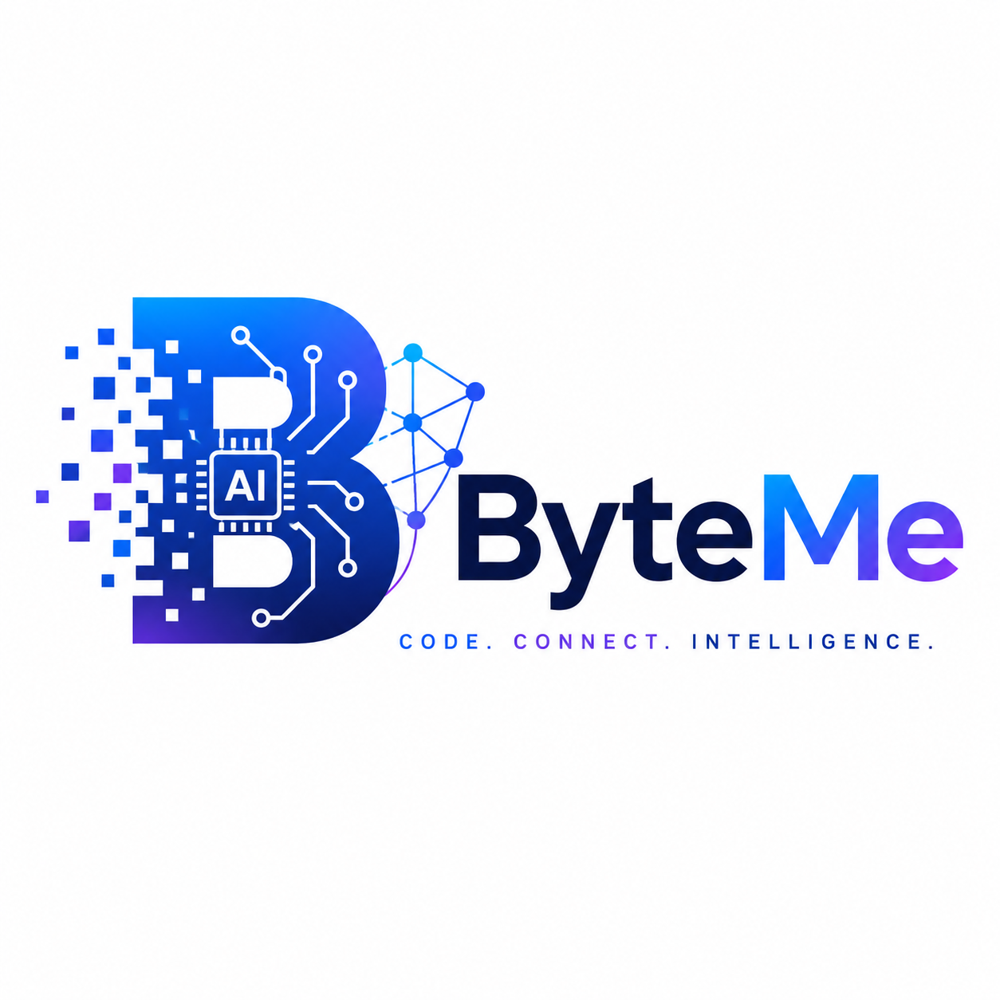

# Festival Pulse 🎵📊

**Festival Pulse** is a real-time dashboard and crowd-monitoring application designed for festival stewards. It enables event staff to report area busyness seamlessly and triggers automated crowd alerts to maintain safety and optimize the attendee experience.

This project was developed collaboratively in a **team of 3**, where we focused on building a scalable, event-driven backend paired with an intuitive, responsive frontend dashboard. 

## 🚀 Features
- **Real-Time Crowd Monitoring:** Stewards can report crowd levels across various festival areas (e.g., Main Stage, Food Court).
- **Event-Driven Alerts:** Automated, real-time alerts are generated and propagated when crowd thresholds are exceeded.
- **Role-Based Views:** Tailored dashboards for both Stewards (reporting) and Command Center Staff (monitoring).
- **Live Event Mapping:** Geographic coordination tracking for individual festival areas.

## 🛠️ Architecture & Technologies Used

The system is built around an **Event-Driven Architecture (EDA)** paired with a standard **MVC** pattern for the RESTful APIs. This ensures high throughput and decoupled processing for real-time crowd metrics.

### Backend Stack
- **Java 21**: Core programming language utilizing the latest language features.
- **Spring Boot 3.3**: Rapid application development, auto-configuration, and dependency injection.
- **Apache Kafka**: Used as the message broker to handle asynchronous `ReportEvent` streams and trigger `CrowdAlert`s reliably.
- **Spring Data JPA & Hibernate**: For ORM and database interactions.
- **H2 Database**: In-memory SQL database for rapid prototyping (easily swappable for PostgreSQL in production).

### Frontend Stack
- **HTML5 / CSS3 / Vanilla JavaScript**: Lightweight, dependency-free frontend to ensure fast loading times on mobile devices for stewards on the ground.
- **RESTful API Integration**: Frontend communicates with the Spring Boot backend via asynchronous fetch APIs.

## 👥 Team Collaboration
As one of the **3 core developers** on this project, my key contributions included:
- Architecting the event-driven communication layer using **Apache Kafka** to decouple the reporting mechanism from the alert processing.
- Developing the REST APIs and mapping out the underlying database schema (`festival_area`, `crowd_report`, `crowd_alert`).
- Collaborating on the frontend dashboard to ensure live data was correctly polled and rendered on the map.
- Emphasizing code quality through comprehensive unit and integration testing.

## 📸 Application Gallery

Here is a glimpse of the Festival Pulse application in action:

*(Note: The images below are dynamically loaded from the repository's resources)*

### 1. Application Live Mapping
> A real-time overview of the festival grounds with live crowd heatmaps and status indicators.

### 2. Reports Page Sample
> A detailed view of historical and active steward reports for specific zones.

### 3. Role Switch Page
> Interface allowing users to transition between Steward Reporting and Command Center views.

---

  
   
  <i>Built with ❤️ by Team ByteMe</i>

